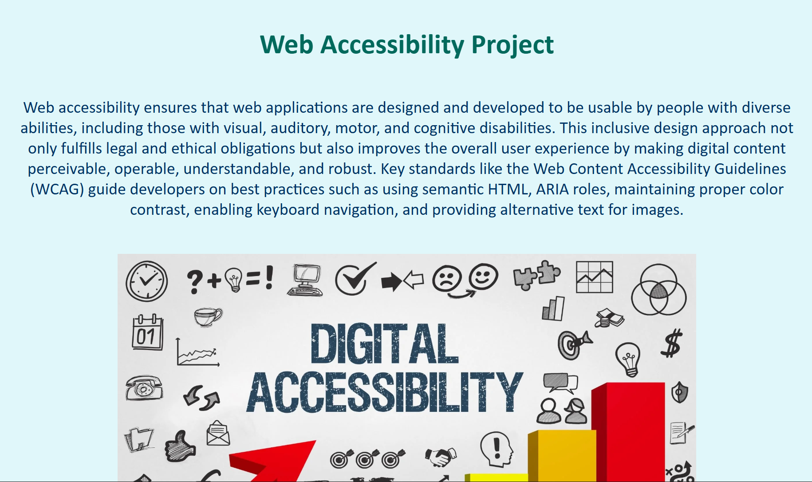

# Web Accessibility Demo Project

This project demonstrates the importance of web accessibility through two example webpages.

## Page 1: Accessible Version
- Contains a clear heading, descriptive paragraph, and an image.
- Includes a small feedback form with properly labeled fields.
- At the bottom, there is a "Go to Other Version" button to navigate to the next page.

## Page 2: Inaccessible Version
- Shows poor color contrast with barely visible text to highlight accessibility issues.
- The feedback form is included but contains no labels, demonstrating poor form accessibility.
- This page emphasizes why web accessibility is necessary for all users.

---

## How to Use
- Open the first page to see a user-friendly, accessible design.
- Use the button at the bottom to switch to the second page to experience the impact of poor accessibility.
- This contrast helps understand the importance of designing inclusive web experiences.

---

## Project Structure
- `Web.html`: Accessible webpage with heading, paragraph, image, form with labels, and navigation button.
- `Web2.html`: Inaccessible webpage with poor contrast, unlabeled form, and navigation button back to page 1.

---

## Screenshots

